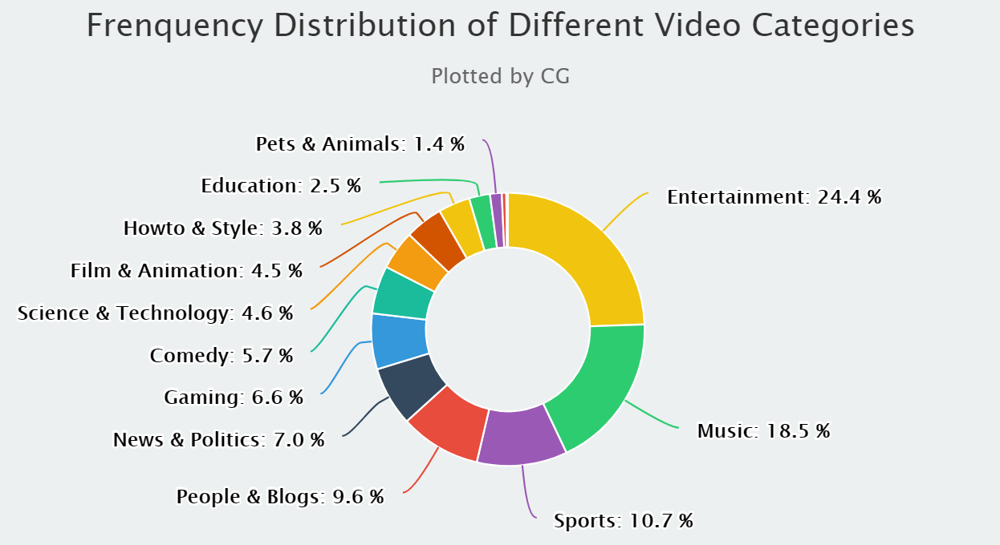

---
output:
  pdf_document: default
  html_document: default
---
---
title: "678 Midterm Project"
author: "Chun Gao"
date: "12/9/2020"
output:  pdf_document
---

```{r setup, include=FALSE}
knitr::opts_chunk$set(echo = TRUE)
library(lubridate)
library(knitr)
library(tidyverse)
library(magrittr)
library(kableExtra)
library(ggplot2)
library(ggpubr)
library(dplyr)
library(highcharter)
library(bootstrap)
library(corrplot)
library(GGally)
library(lme4)
library(arm)
library(caret)
library(gridExtra)
```

# Abstract

As the total amount of videos’ airplay streaming on YouTube is now regarded as one of the essential factor for measuring the producer’s popularity, more and more attention has been paid to the primary factors that might influence the videos’ views counts. Based on this premise, we developed a multi-level linear model to evaluate whether and how can selected measurements affect YouTube video’s view counts. The results indicated that all the selected predictors can significantly affect the number of videos’ total views.


# Introduction

As the largest online video sharing platform, YouTube has significant amount of data that can indicate cultural trends to a certain extent. Besides, recording uploaded videos’ total view counts can be a good indicator of examining the impact of entertainment products. Therefore, we conduct a research on YouTube’s data to help artists find the right position to increase their exposure to the public. This report will focus on the level of influence of different factors to video’s view counts, and for example, the factors include the category of videos, counts of “likes” of videos, etc. Besides using a multilevel model to analyze the relationship between these proxies and view counts, we will also take the difference between different video categories into account. The data we use to analyze in this project comes from Daily Statistics for Trending YouTube Videos dataset.


# Methods

## Data Cleaning and Selection

```{r, include=FALSE, message=FALSE}
## import two data sets and combine the two, and select needed variables 
US <- read.csv("US_youtube.csv", head=TRUE)
KR <- read.csv("KR_youtube.csv",head=TRUE)
YT <- rbind(US,KR)
# head(YT)
YT <- YT[,c(3,6,7,9,10,11,12)]
# colnames(YT)
# [1] "publishedAt"   "categoryId"    "trending_date" "view_count"    "likes"        
# [6] "dislikes"      "comment_count"

## calculate the interval time from the video been published to been listed on the trending list
YT$publishedAt <- as_datetime(YT$publishedAt)
YT$trending_date <- as_datetime(YT$trending_date)
timelength <- as.integer(round(difftime(YT$trending_date, YT$publishedAt, units="hours")))
YT$time <- timelength
# summary(YT$time)
#   Min. 1st Qu.  Median    Mean 3rd Qu.    Max. 
# -12.00   33.00   68.00   73.09  105.00  731.00 

## "time" is unreasonable to be negative, so I delete the negative value
YT <- YT %>% filter(time >= 0 & view_count > 0)
# summary(YT$time)
#   Min. 1st Qu.  Median    Mean 3rd Qu.    Max. 
#   0.00   36.00   71.00   75.74  107.00  731.00 

## further select needed variables and rename the variables
YT <- YT[,-c(1,3)]

## in category_id.csv, we know the specific category corresponding to the id. number in YT, so I add the specific category into my dataset
CGID <- read.csv("category_id.csv")
colnames(CGID) <- paste(c("categoryId","Category"))
YT <- left_join(CGID,YT,by="categoryId")
YT <- na.omit(YT)
colnames(YT) <- paste(c("CGID","Category","Views","Likes","Dislikes","Comments","Time"))
```

```{r, fig.cap="Frenquency Distribution of Different Video Categories", fig.height=3 , fig.width=5, echo=FALSE, warning=FALSE, message=FALSE}

```

Raw data was imported and cleaned by the "tidyverse" package. We combined Korean Youtube and US YouTube data and deleted some irrelevant variables such as the video ID, video title, and video tags. Besides, to better perform the research, we calculated the interval time from the video published to the video been listed on the trending list using the "lubridate" package.  Our data contains video information in 14 categories, including "Entertainment", "Music", "Sports", "Education", etc. The frequency distribution of each video Category is displayed in figure 1.

```{r, echo=FALSE, warning=FALSE, message=FALSE}
YT1 <- YT
categorydist <- YT1 %>% group_by(Category) %>% summarize(count=sum(Category!= "0"))
categorydist <- categorydist[order(categorydist$count),]
categorydist <- arrange(categorydist, desc(count))
colnames(categorydist) <- paste(c("name","y"))
```

```{r, eval=FALSE, echo=FALSE, warning=FALSE, message=FALSE}
F <- highchart() %>% 
  hc_chart(type = "pie") %>% 
  hc_add_series(data = categorydist,
                innerSize = '60%',
                colorByPoint = TRUE) %>% 
  hc_tooltip(pointFormat = '{series.name}: <b>{point.percentage:.1f}%</b>') %>% 
  hc_title(text = 'Frenquency Distribution of Different Video Categories') %>% 
  hc_subtitle(text = "Plotted by CG") %>% 
  hc_add_theme(hc_theme_flat()) %>% 
  hc_plotOptions(pie = list(
    allowPointSelect = TRUE,
    cursor = 'pointer',
    dataLabels = list(
      enabled = T,
      format = '<b>{point.name}</b>: {point.percentage:.1f} %'
    ),
    showInLegend = T
  ))
```

## Model selection and transformations

We used a multilevel model with "Category" being a random intercept. To reduce the effect of colinearity, the variable "Dislikes" was deleted and replaced by "LDratio". "LDratio" is calculated using the equation $LDratio = \frac{Likes}{Likes + Dislikes}$. This variable could measure the video's degree of controversy. If the video has a greater "LDratio" number, the video is less controversial. Besides, there is a large difference between the range of each variable in the data set. Hence, we rescaled the data by using the logarithm of the large-scale variable.Figure 5 and Figure 6 in the appendix compares the correlation plots between variables before and after the data transformation. 

```{r, include=FALSE, message=FALSE}
YT2 <- YT[,-2]
cor <- cor(YT2)
c1 <- corrplot.mixed(cor, tl.col ="brown")  
```

```{r, include=FALSE, message=FALSE}
YT3 <- YT
YT3  %<>% mutate(LDratio = Likes/(Likes+Dislikes))
YT3$LDratio <- as.numeric(YT3$LDratio)
YT3 <- subset(YT3,YT3$LDratio!="NaN")

YT_L <- YT3
YT_L %<>% mutate(Log_Views = log(Views),Log_Comments = log(Comments), Log_Time = log(Time), Log_Likes = log(Likes) )
YT_Ln <- YT_L[,-c(3,4,5,6,7)]
YT_Ln <- subset(YT_Ln, Log_Views>0 & Log_Comments>0 & Log_Time >0)
YT_cor <- YT_Ln[,-2]
cor01 <- cor(YT_cor)
c2 <- corrplot.mixed(cor01, tl.col ="brown", lower.col = "dark green")  
```


# Results

## Estimations

Figure 2 demonstrated the effects of the multilevel model as well as their 95% confidence interval. Though the confidence intervals for some variables are too small to be displayed as a line, Log_Comments, Log_Likes, Log_time, and LDratio all significantly affect the Log_Views. Specifically, Log_likes have relatively stronger evidence of a positive effect on Log_Views. With other predictors keeping constant, one unit increase in the Log_Views is expected to cause 0.5105 unit growth in Log_Views. Besides, LDratio has a strong negative effect on Log_Views; one unit decrease in the LDratio would lead to a -2.0574 unit increase in Log_Views. 

Additionally, for the videos with the same Log_Comments, Log_Likes, Log_time, and LDratio values, videos listed in the Nonprofits & Activism category are expected to have the least views count; on the contrary, sports category videos would have the most view counts.

```{r, include=FALSE, message=FALSE}
m_l <- lmer(Log_Views~Log_Likes+Log_Comments+Log_Time+LDratio+(1|Category), data=YT_Ln)
display(m_l,digits=4)
```

```{r, include=FALSE, message=FALSE, include=FALSE}
print(coef(m_l))
```

```{r,include=FALSE, message=FALSE}
ci <- as.data.frame(confint(m_l))
ci <- ci[3:7,]
ci  %<>% mutate(name = row.names(ci) )
colnames(ci) <- paste(c("ymin","ymax","name"))
ci  %<>% mutate(y=fixef(m_l) )
```

```{r,fig.cap="Coefficient Estimates", echo=FALSE, warning=FALSE, message=FALSE}
ggplot(ci,aes(x=y, y=name,xmin=ymin,xmax=ymax),sixe=0.2)+
  geom_pointrange(size=0.1)+
  geom_vline(xintercept=0, color="dark red")+
  labs(x = "95% Confidence Interval",
         y = "Coefficient",title="Coefficient Estimates")+
  theme(plot.title = element_text(hjust = 0.5))
```

## Validation

Overall, the model fits well; the middle range's outcome would have a better fit than the two ends have. The figure 3 displays the residual plot of the regression model. Though some outliers, most of the points are evenly distributed on both sides of the horizontal line. The prediction plot figure shows that most points are clustered on this line with slope 1 and intercept 0.

Based on the calculation, the fitted model's R-Square is 0.80, and MSE is 0.58, demonstrating that the model fits well.

```{r,fig.cap="Residual Plots", fig.height=3 , fig.width=5, echo=FALSE}
rd <- plot(m_l)
rd
```

```{r,fig.cap="Prediction", fig.height=3 , fig.width=5, echo=FALSE}
p <- ggplot(YT_Ln) + 
  geom_point( aes (x = Log_Views, y = predict(m_l)),color="dark green",size=0.5) + 
  geom_abline(intercept = 0, slope = 1, color="dark red")+ 
  labs(x= "'Log_Views'",
         y = "Predicted 'Log_Views'" )
p
```

```{r, include=FALSE}
y_true <- YT_Ln$Log_Views
y_predict <- predict(m_l)
R_square <- R2(y_predict,y_true)
RMSE <- RMSE(y_predict,y_true)
```

# Discussion

Some of the model results are unexpected. For example, under the same condition (observed value of predictors are the same), sports videos would have the most views instead of entertainment videos. Besides, videos with lower LDratio value would have higher views amounts. This could be due to controversy is often more eye-catching.

The limitation of the fitted model is non-negligible. First, from figure 1, we know that the frequency distribution of videos of different categories is uneven. Entertainment videos accounted for 24.4% of the total, whereas Nonprofits & Activism solely accounted for 0.2%. Such uneven distribution undoubtedly affects the model's accuracy negatively. Additionally, there are high correlations between predictors. We attempted to delete some predictors in the model as much as possible, and we chose the model with the best fits as the final model. We should consider whether other less colinear variables affect the views counts, the interaction of two predictors included. Moreover, we used random intercept with fixed slopes in our multilevel model and have not used the random intercept and slopes model. Maybe we could find some more predictors in the raw data to perform the multilevel model with random slopes and intercepts.


# Bibliography

1.[Trending YouTube Video Statistics]:(https://www.kaggle.com/datasnaek/youtube-new)
2.GELMAN, A., & HILL, J. (2007). Data analysis using regression and multilevel/hierarchical models. Cambridge,  Cambridge University Press.
3.Garrett Grolemund, Hadley Wickham (2011). Dates and Times Made Easy with lubridate. Journal of Statistical Software, 40(3), 1-25. URL https://www.jstatsoft.org/v40/i03/.
4.Joshua Kunst (2020). highcharter: A Wrapper for the 'Highcharts' Library. R package version 0.8.2. https://CRAN.R-project.org/package=highcharter
5.Max Kuhn (2020). caret: Classification and Regression Training. R package version 6.0-86. https://CRAN.R-project.org/package=caret
6.Taiyun Wei and Viliam Simko (2017). R package "corrplot": Visualization of a Correlation Matrix (Version 0.84). Available from https://github.com/taiyun/corrplot

\newpage
# Appendix

```{r, fig.cap="Correlation Plots before Transformation", fig.height=4 , fig.width=5, echo=FALSE, warning=FALSE, message=FALSE}
c1 <- corrplot.mixed(cor, tl.col ="brown")  
```

```{r, fig.cap="Correlation Plots after Transformation",fig.height=4.5 , fig.width=5.5,echo=FALSE, warning=FALSE, message=FALSE}
c2 <- corrplot.mixed(cor01, tl.col ="brown", lower.col = "dark green") 
```

```{r,fig.cap="Relationship between LDratio to Log_Views for each category",warning=FALSE, echo=FALSE, message=FALSE }
ggplot(YT_Ln)+
  geom_point(size=0.5)+
  aes(x=LDratio,y=Log_Views,color=factor(Category))+
  facet_wrap(~Category,scales="free")+
  theme(axis.text.x = element_text(angle = 45, hjust = 0.5, size=9))
```

```{r,fig.cap="Relationship between Log_Comments to Log_Views for each category",warning=FALSE, echo=FALSE, message=FALSE }
ggplot(YT_Ln)+
  geom_point(size=0.5)+
  aes(x=Log_Comments,y=Log_Views,color=factor(Category))+
  facet_wrap(~Category,scales="free")+
  theme(axis.text.x = element_text(angle = 45, hjust = 0.5, size=9))
```
